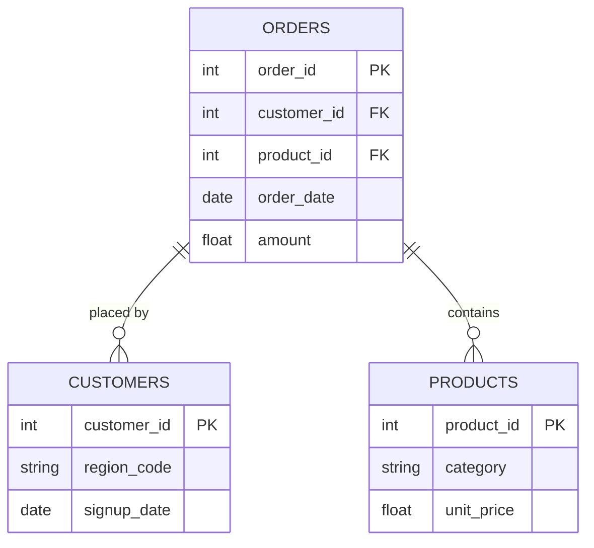

# [Project Title]
> *HR Dashboard Analysis*


## ⚙️ Project Type Flags

- [ ] SQL Analysis / Querying
- [ ] Dashboard / Data Visualization
- [ ] Data Cleaning
- [ ] End-to-End Project


## Table of Contents
1. [Project Overview](#1-project-overview)
2. [Objectives](#2-objectives)
3. [Project Scope & Tools](#3-project-scope--tools)
4. [Repository Structure](#4-repository-structure)
5. [Data Workflow](#5-data-workflow)
6. [Data Model & Schema](#6-data-model--schema)
7. [ERD - Entity Relationship Diagram](#7-erd--entity-relationship-diagram) *(SQL projects)*
8. [Analysis & Metrics](#8-analysis--metrics)
9. [Key Insights](#9-key-insights)
10. [Recommendations](#10-recommendations)
11. [Assumptions & Limitations](#11-assumptions--limitations)
12. [Future Enhancements](#12-future-enhancements)
13. [Deliverables](#13-deliverables)
14. [Author](#14-author)

---

## 1. Project Overview

 This HR Analytics Project Analyzes Employee Performance, Attendance, Productivity, Training, and Promotion Readiness using SQL and Power BI. The data was cleaned and Analyzed to Evaluate 
 key HR Metrics, Identify Performance trends, and Compare Department-Wise Performance and Interactive Power BI Dashboard was Developed to Visualize KIPS and generate actionable Insights,
 Enabling HR teams to Make Data-Driven Decisions for Employee Development, Performance Management, and Promotion Planning.


**Problem Statement: ** [The Organization has Employee Data but lacks Clear insights into Employee Productivity, training, and Promotion Eligibility. The business needs to analyze Performance patterns, Recognize areas for Improvement, and Support better HR decision-Making.]


## 2. Objectives

To Analyze Employee Performance, Productivity, Attendance, Training Data to Identify high performing Employees Driven HR Decision on Promotion and Employee Development.
 

## 3. Dataset Info & Tools
Name: Employee performance Dataset.
Source: Kaggle.
No. of Rows: 5000
No. of Columns: 13
Types: HR Data Contains Employee Demographics Details Department Info, job roles, Attendance Records, Perform Score, KPIS Score, Task Completion, Peer ratings, and Promotion Eligibility.

### Tools & Technologies
Tool(s) Used 
Excel, SQL, Power BI

Excel: Conducted initial Data inspection and verified the dataset before analysis, also I changed some column names.
SQL: Queried the Dataset, performed aggregations, analyzed attendance records, performed PIS Score, task Completion, peer rating, promotion Eligibility.
Power BI: Developed HR Analytics Dashboard, Created KPI Card for Average Attendance, Total Employee and Promotion Eligibility.


## 4. Repository Structure


[project-root]/
│
├── data/
│   ├── raw/                  # Original, unmodified source data - never edited
│   ├── processed/            # Cleaned and transformed data
│   └── external/             # Reference data, lookup tables, third-party files
│
├── notebooks/                # Jupyter, R Markdown, or Colab notebooks
│
├── scripts/                  # Reusable .py, .R, or .sh processing files
│
├── queries/                  # SQL files (retain this folder for SQL-heavy projects)
│   ├── exploratory/          # Ad-hoc or investigative queries
│   ├── transformations/      # Cleaning and reshaping logic
│   └── final/                # Production-ready or presentation queries
│
├── reports/                  # Final outputs: PDFs, slide decks, Word docs
│
├── visuals/                  # Exported charts, dashboard screenshots, ERD diagrams
│
├── docs/                     # Data dictionaries, schema notes, reference material
│
├── project_metadata.yml      # Machine-readable metadata (optional)
└── README.md                 # You are here


## 5. Project Workflow

  1. Source: "Collected the Employee Performance Dataset from Kaggle."
  2. Ingestion: "Loaded into Excel Performed Detail inspection before Analysis and also changed column names."
  3. Cleaning: "Performed Data cleaning and Analysis Business Insights Using SQL."
  4. Transformation: "Created aggregation Queries, Group by queries ."
  5. Analysis: "Developed Interactive Dashboard and KPIS using Power BI."
  6. Output: "Summary report (PDF), processed CSV."


## 6. Data Model & Schema

<!--
  Define your fields so that someone reading your analysis can follow along
  without digging through your code.

  WHAT GOOD LOOKS LIKE (one row example):
  | transaction_id | string | Unique identifier per sales transaction | TXN-00482 |
  | return_flag    | boolean | Whether the transaction included a return | TRUE |
  | region_code    | string | Two-letter identifier for store region | "NE" |

  WHAT TO AVOID:
  ❌ Skipping this section because "the field names are self-explanatory."
     They're not. Not to a reviewer. Not to you in six months.

  📌 FOR SQL PROJECTS: If you have multiple tables, create one block per table.
     Describe join keys and relationships here. Your ERD (Section 7) will
     visualise what this section describes in text.

  📌 FOR NON-SQL PROJECTS: Describe the shape of your dataset informally
     if a formal schema doesn't apply. Even one paragraph is more helpful than nothing.
-->

### Dataset / Table: `[name]`

| Field Name | Data Type | Description | Example Value |
|------------|-----------|-------------|---------------|
| `[field_1]` | [string / int / date / float / boolean] | [What this field represents] | [Non-sensitive example] |
| `[field_2]` | [string / int / date / float / boolean] | [What this field represents] | [Non-sensitive example] |
| `[field_3]` | [string / int / date / float / boolean] | [What this field represents] | [Non-sensitive example] |

> **Row count (approx.):** [X rows]
> **Date range:** [Start] – [End]
> **Key join / relationship:** [e.g., `orders.customer_id` → `customers.id`]

*Add additional table blocks as needed for multi-table projects.*

---

## 7. ERD - Entity Relationship Diagram
### *(Primarily for SQL Projects - remove this section if not applicable)*

<!--
  An ERD shows how your tables connect to each other visually.
  It is the fastest way for a reviewer to understand the data structure
  of a SQL project without reading every query.

  HOW TO INCLUDE YOUR ERD:
  Option A - Image embed (most common):
    Export your ERD from dbdiagram.io, DBeaver, Lucidchart, or similar.
    Save to /visuals/erd.png and reference it below.

  Option B - dbdiagram.io code block (version-controllable):
    Paste your schema definition code directly in the fenced block below.
    Anyone can paste it into dbdiagram.io to regenerate the visual.

  Option C - Mermaid diagram (renders natively in GitHub):
    Use the mermaid code block syntax below.
    GitHub will render this as a diagram automatically.

  PICK ONE. Don't use all three. Delete the options you don't use.
-->

### Option A - Embedded Image

*[Brief caption: e.g., "Three-table schema - orders, customers, and products joined on shared IDs."]*

---

### Option B - dbdiagram.io Schema Definition
```
Table orders {
  order_id    int     [pk]
  customer_id int     [ref: > customers.customer_id]
  product_id  int     [ref: > products.product_id]
  order_date  date
  amount      float
}

Table customers {
  customer_id int  [pk]
  region_code string
  signup_date date
}

Table products {
  product_id   int    [pk]
  category     string
  unit_price   float
}
```
*Paste this into [dbdiagram.io](https://dbdiagram.io) to view the visual.*

---

### Option C - Mermaid Diagram *(renders on GitHub)*


---

**Table Relationships Summary:**

| Relationship | Join Key | Type |
|-------------|----------|------|
| `orders` → `customers` | `customer_id` | Many-to-One |
| `orders` → `products` | `product_id` | Many-to-One |
| [Add rows as needed] | | |

---

## 8. Analysis & Metrics

### Analytical Approacch

1.Analyzed Employee Performance across Different Departments.
2.Evaluated Attendance trends and Workforce Productivityy.
3.Analyzed Training Hours and Workforce Logged to Identify Productivity patterns.
4.Identified Employees Eligibility for Promotional Based on Performance.
5.Generated Actionable Insights to Support employees Development and performance Management.
6.Enabled Data-Driven HR Decisions Making it through Interactive Visualizations and Reports.

### Key Metrics Defined
[No. of Employees.] [No. of Employees from Different Job Roles.] [No. of Highest Employees.] [Average Attendance rate.] [Average Performance rate.] [Average Task Completion.] 
[Average Peer Ratings._] [Total Highest Attendance.] [Which Department has Highest Task Completion rate.] [Total Work Hours logged.] [Total Training Hours_]
[Total Performing score.] [Low Attendance rate.] [No. of Employees Eligible for promotions.] [No. of Highest and Lowest Departments Eligible for Promotions.]

## 9. Key Insights

**Insight 1:[Identified the Distribution of Employees across Different Departments.]

**Insight 2:[Analyzed the distribution of Employees by Job Role.]

**Insight 3:[Evaluated the Average Attendance of Employees across the Organization.]

**Insight 4:[Compared Department-Wise Attendance to Identify Departments with the Highest and lowest attendance.]

**Insight 5:[Analyzed the Average Task completion Rate, Peer Rating, and Performance.]

**Insight 6:[Evaluated Department-Wise Task Completion to Identify High Performing Departments.]

**Insight 7:[Analyzed Total Training Hours and Work Hours Logged across Department.]

**Insights8:[Identified employee Eligible for promotion to Support HR Decision Making.]

## 10. Recommendations

  1.Provide Additional Training and Skill Development Programs for Low-performing Employees.
  2.Recognized and Reward High-Performing Employees to Improve motivation and Retention.
  3.Use Promotion Eligibility Metrics to Ensure Fair and Transparent Promotion Decisions.
  4.Track Employee performance Continuously using Interactive HR Dashboards.
  5.Use Data-Driven Insights to Improve Workforce Planning, Performance Management, and Talent Development.

## 11. Assumptions & Limitations

<!--
  WHAT GOOD LOOKS LIKE:
  Assumption: "Transaction records were assumed to be complete for all five regions.
               No validation was performed against source system record counts."
  Limitation: "The analysis cannot distinguish between returns initiated by
               the customer vs. returns initiated by the business (e.g., recalls).
               If business-initiated returns are concentrated in Region A, the
               return rate finding may reflect a policy decision, not a quality issue."

  WHAT TO AVOID:
  ❌ Leaving this section blank or writing "None known."
     Every project has limitations. Documenting them is a sign of
     analytical maturity - not a confession of failure.
-->

### Assumptions
- [What did you treat as true without being able to verify?]
- [What simplifications did you make for scope or feasibility?]
- [What domain rules or definitions did you accept as given?]

### Limitations
- [What gaps exist in the data?]
- [What analysis was out of scope but could affect interpretation?]
- [What would a more rigorous version of this project include?]
- [Are there known biases in the data source or collection method?]

> *The goal here is pre-emptive Q&A. What would a thoughtful skeptic push back on? Document the answer here, before they ask.*

---

## 12. Future Enhancements

- [ ] [Enhancement 1 - Integrate Real-time HR Data From HRMS or ERP Systems for live performance monitoring.]
- [ ] [Enhancement 2- Build a Promotion Recommendation System Using Employee Performance and KPI Data.]
- [ ] [Enhancement 3- Implemented Employee Segmentation Based on Performance, Skills, and Productivity.]
- [ ] [Enhancement 4 - Develop Predictive Models to Identify Employees at Risk of Low performance or attrition.]
- [_] [Enhancement 5 - Perform Sentimental Analysis on Employee Feedback and Survey Responses to Measure job Satisfaction.]


## 13. Conclusions

This HR analytics Project Successfully analyzed Employee Performance, Attendance, Productivity, Training and Promotion Readiness Using SQL and Analyzed to identify Work forced trends and Key HR Metrics.
An Interactive Dashboard was Developed to Visualize Employee and Department Performance, Enabling Data-Driven HR Decision-Making. The Insights and Recommendations from this Project Can Help Improve Employee 
Performance, Optimize Training Programs, Support Fair Promotion Decisions, and Enhance Overall Workforce Efficiency.

## 14. Author

**[Zeba Hajera] **
[Data Analyst]

- 🔗 [LinkedIn URL]
- 💼 [Portfolio or GitHub profile URL]
- 📧 [zebahajera715@gmail.com]
